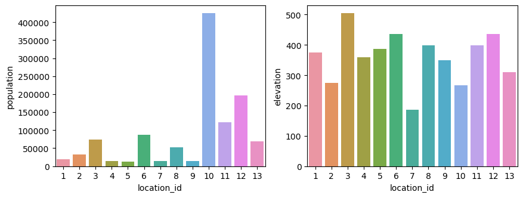
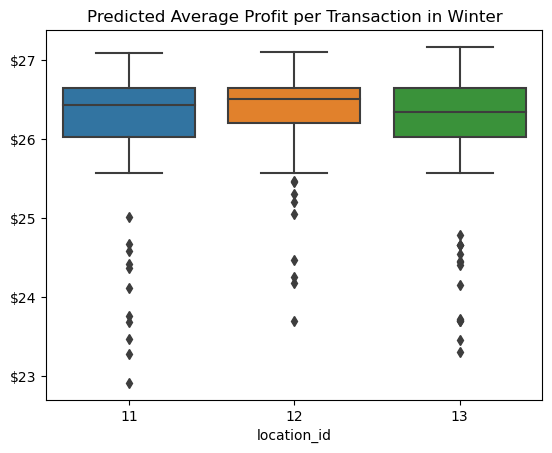

# Managerial Report

## Business Context
Tyler's Tubing is an outdoor recreation business that offers rentals of equipment for river rafting in the summer and snow rafting in the winter. These activities are highly seasonal and weather dependent, so the business only operates during certain times of the year. The overhead costs and day-to-day expenses are relatively low, and this small business has been profitable over the past few years. The company currently has rental locations in 10 different 
cities.

## Business Problem and Research Question

The business problem is that the company is interested in choosing one of the three candidate locations, 11, 12, and 13. We have access to data regarding all locations' population and elevation, their historical weather data, and also the profit of transactions at the day level for locations 1 to 10 that have been active from January 2019 to October 2022. One crteria for choosing between candidates is the profit that they can make. One strategy for comparing the potential of these candidates for making profit is to estimate how much profit each of them would make, if it was active in the past. So the question is based on a predictive model, which one of these candidate locations would make the highest profit from January 1st through October 30th of 2022. To answer this question we made a machine learning model to predict daily average profit of locations, and compare the candidate locations based on their prediction of average daily profit. Our results show that in terms of daily average profit locations are not significantly different from eachother, but in winter the average daily profitability of laction 12 is significantly higher compared to locations 11 and 13.

## File Structure
The files of the proejct are structured as follows:

1 - `data-exploation.ipynb`: This file contains the code for exploring and cleaning the data.

2 - `modeling.ipynb`: This file contains the code for modeling.

3 - `inference.ipynb`: This file contains the code for inference, and comparision of the models.

## Data Exploration
We have data about the locations, weather and transaction profits. We explore each group of data seperately. Also since the operation of the business changes between summer and winter, we explore the data for summer and winter sepreately to get a better understanding. 

### Location Data
Exploation of the location data of demonstrate that, location number 10 is much more populated than other locations. Elevations are closer to eachotehr. Also in candidate both location, and elevation of location 12 is higher than location 11 which is itself higher and more populated than location 11.

### Weather Data
Comparing the plots, that boldest thing is that between three target areas of 10, 11, and, 12, compared to the other two areas 13 is colder, 12 is warmer and 11 has more cloudy days and precipitation. In summers, compared to other two areas, 12 has lower pressure and higher humidity. In winters, compared to other two areas, 11 has lower pressure and 13 has lower humidity. 

### Profit Data
Since our unit of observation for the weather data is day, we set our unit of analysis to day. To do this we aggregate the profit data to average profit of each day. An interesting point in the daily profit graphs is that the number of days with negative profit is much more in winter compared to summer. It may be the case that in summer people come tubing regularly since schools are closed, and days are also longer. However, in the winter poeple come to tubing only in the weekends which are the days that make the positive profit, but for rest of the days the profit is negetive.

## Modeling
In the modeling part we trained a model to predict average daily profits based on location, weather data, month of the transaction and if the transaction is on a weekend or weekday. Overall we had 7225 data points. 80% of the data is randomly selected for training and the rest as used for testing. We trained an XGoost regression model and used random-grid with 500 itterations, two-fold cross validation with one repeatition to do the hyper-parameter tunning. The best model based on the root mean square error of the validation set is chosen to be trained on the whole training dataset and is test on the test set. The final root mean square error of the test set is equal to 5.25. The learning curve for the training and test datasets is shown in the graph below.

To add some explainability to our model I have extracted the feature importance using XGboost. The following curve shows the feature importance. Population, temprature, and elevation are the top three important features. Next is if the transaction is in month Feburary, and pressure. The rest of the features are comparaitively lesss important.

## Results and Recommendations
Our results shows that the difference between mean of daily profit for three candidate locations is not significant at the 95% confidence interval for summer seasons. However for winter seasons the mean of per transaction profit of location 12 is significantly larger than location 11 and location 13. Plot below shows the difference between these three candidate and the table shows the mean income per transaction during winter in different locations.

| Location ID | Profit per Transaction in Winter (in Dollors)|
|-------------|----------------------------------------------|
| Location 11 | 26.21                                        |
| Location 12 | 26.35                                        |
| Location 13 | 26.13                                        |

## Disussion and Suggestion for Future Work
Our analysis shows that Location 12 is a better place, and it is in compliance with our data exploration and feature importance analysis, since it is warmer in winters, and it is more populated (two of the most important features). However, now that I am thinking, if I had the time, I would do an analysis with total sum of transactions each day instead of the average of transactions per day. When I was designing this metric, I was thinking we prefer a few highly profitable transactions to a lof of low profit ones, but now that I have wrote about the analysis, I think doing a model with the sum of transactions per day must also be useful.

Another thing that I think is intersting, is to look at the number businesses that are complement or substitute for the tubing business in the areas close to each of these locations. This is a feature that can be extracted from Google map, and can have good predictive power. As an extra source of information I would check the social media pages of these places and tried to build a customer satisfaction metric for them as well. The least I could do with it is to exclude locations that their customer service is much worse or much better than the other places, since this can affect our analysis a lot.

The next thing that I would have looked at, is that the time that we are considering is the time that Covid hit everywhere, and people in different places have different degrees of compliance to social distancing. I would put this as another feature, since peopel may go to one of these places because social distancing is high. Acfter training the model, to get the estimates I would have tried to eliminate the effect of covid, by putting it the compicance of peopel to social distancing to the lowest degree for my candidate places, since probably by the time they start there is no social distancing in place.

## Limitations
I had one week to do this assignment, and I did it in a single weekend day since I was busy with courses, reseach, TA and other PhD stuff. If I had more time and the scope of this work was bigger, I would explore the data much more, tried more models withe more hyper-parameters, and tried to also understand my target variable better. I would also put a lot more time in refactroing and documenting my code and writing this managerial report.  